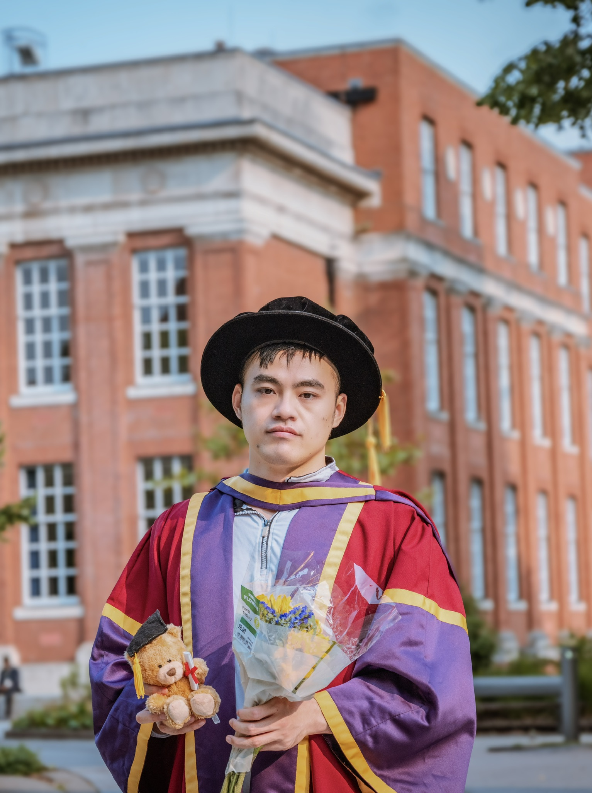

Thrilled to announce that I have successfully defended my PhD viva and have officially been awarded the title of Doctor of Philosophy (PhD) from The University of Manchester!

This journey has been one of growth, perseverance, and invaluable support from my supervisors, Dr. Robert Heinemann and Otto Jan Bakker, peers, and family. Thank you to everyone who has been part of this chapter. I couldn’t have done it without you.

Excited for the next stage ahead!

