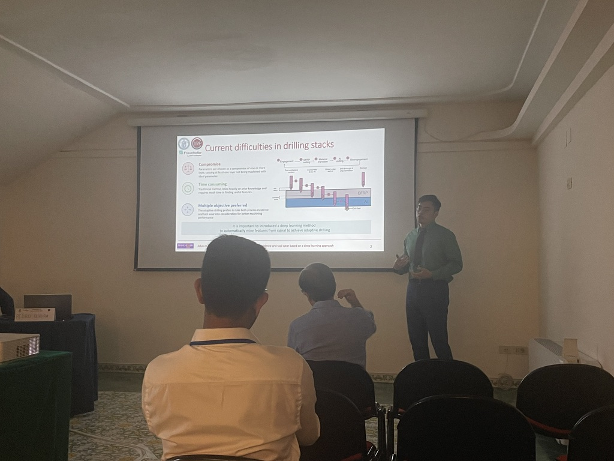

According to the email confirmed by the organiser of CIRP ICME '28, our paper entitled, "In-process unified prediction for process incidence and tool wear based on a deep learning approach", gets accepted.

> When drilling carbon fibre reinforced polymer (CFRP)/Al stacks, adaptive drilling can allow for the optimisation of cutting parameters for each stack layer, which not only increases cutting efficiency but also improves borehole quality. This work proposes a deep learning approach to both identify process incidence and determine the tool wear level, the outcome of which can then be used to notify the machine tool to adjust cutting parameters or replace the tool if necessary. Several signals obtained at different tool wear stages were fed into a multi-output deep learning model to assess the accuracy and reliability with which five process incidences (tool engagement, cutting CFRP, material transition, cutting Al and tool disengagement) and tool wear during drilling can be identified. The work contributes to the decision making and optimisation about cutting parameter and cutting tool replacement in adaptive drilling of aerospace stacks.

We will make an special page to introduce the principles of our paper. Please keep updated for the [project](/project) page

### Please note

Due to the copyright issue, we are not able to share the full paper here. Please keep an eye on the official website of CIRP ICME '28 for the latest publication information. 